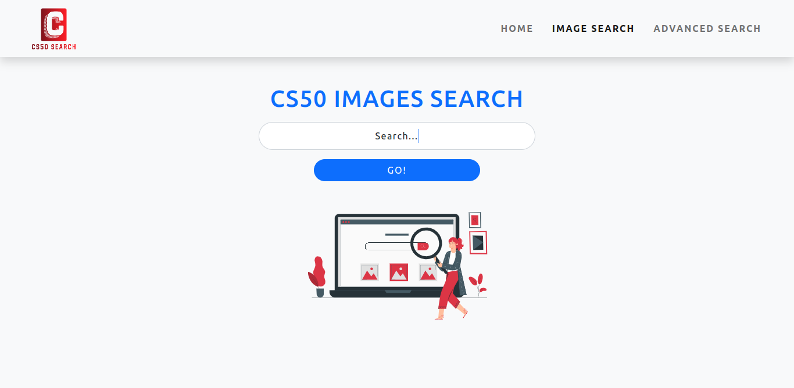

<h1 align="center">
   <a href="#"> CS50 SEARCH </a>
</h1>

<h3 align="center">
    A website made as project 0 of the CS50W course
</h3>

<h4 align="center"> 
	 Status: In progress
</h4>

<p align="center">
 <a href="#about">About</a> •
 <a href="#live-version">Live version</a> •
 <a href="#features">Features</a> •
 <a href="#screenshots">Screenshots</a> • 
 <a href="#how-it-works">How it works</a> • 
 <a href="#tech-stack">Tech Stack</a> • 
 <a href="#author">Author</a> •
</p>

## About

CS50 search implements a front-end for google search, including: common search, 'Feeling lucky' search, images search and advanced search.

---

## Live version

Access the [live version](https://space-travel101.netlify.app/)

---

## Features

- Responsiveness
- Search result pages for search terms
- Search for a term and be redirected to the first page on search results (Feeling lucky feature)
- Search images for search terms
- Advanced search to find more accurate results

---

## Screenshots

### Mobile

<p align="center" style="display: flex; align-items: flex-start; justify-content: center;">
  

  

  
</p>

### Web

<p align="center" style="display: flex; align-items: flex-start; justify-content: center;">
  

  

  
</p>

---

## How it works.

### Pre-requisites

Before you begin, you will need to have [Node.js] (https://nodejs.org/en/) installed on your machine.

#### Running the web application (Frontend)

```bash

# Clone this repository
$ git clone https://github.com/nogueirayure001/CS50W-search.git

# Access the project folder in your terminal
$ cd CS50W-search

# Install the dependencies
$ npm install

# Run the application in development mode
$ npm run dev

# The application will open on the port: 3000 - go to http://localhost:3000

```

---

## Tech Stack

The following tools were used in the construction of the project:

- **[Vite](https://vitejs.dev/)**
- **[Bootstrap](https://getbootstrap.com/)**
- **[Sass](https://sass-lang.com/)**

---

## Author

[Linkedin] (https://www.linkedin.com/in/nogueirayure/)
[Gmail] (mailto:nogueirayure1993@gmail.com)
